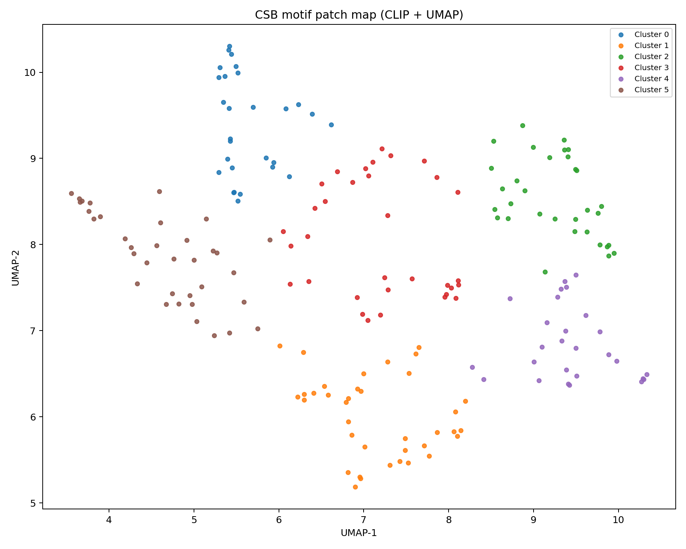

# CSB-AI

AI-assisted motif mapping of Scotland’s Carved Stone Balls

## Overview

This project explores how artificial intelligence can help surface visual similarities in Scotland’s **Carved Stone Balls (CSBs)**.  
We re-purpose a computer vision pipeline (CLIP embeddings + clustering) to group small carved patches and visualise them as a **“motif map.”**

The goal is not to assign meanings, but to provide archaeologists with a new way of exploring possible **families of motifs** across different balls.

## Features

- **Patch extraction:** each ball photo is divided into small squares, focusing on carved regions.
- **Visual embeddings:**
  - _CLIP_ (deep neural model, semantic grouping)
  - _HOG_ (lightweight texture-based baseline)
- **Dimensionality reduction:** PCA + UMAP for 2D layout.
- **Clustering:** K-means to highlight families of similar motifs.
- **Interactive explorer:** React + Plotly front-end with guided tour for non-technical users.
- **Case studies:** examples of shared patterns across different CSBs.

## Live Demo

👉 [csb-ai.netlify.app](https://csb-ai.netlify.app) _(Netlify build from `/site` folder)_

## Repository Structure
